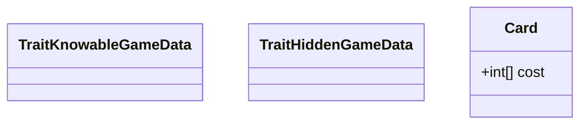
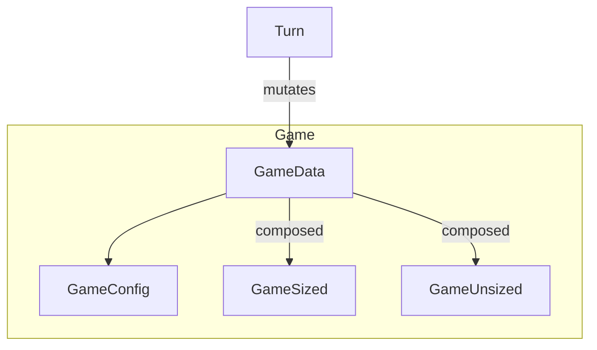

## Target project module layout??? todo

```mermaid
classDiagram
    class TraitKnowableGameData {
        
    }
    class TraitHiddenGameData {
        
    }
    class Card {
        +int[] cost
    }

```

```mermaid
flowchart TD
    subgraph Game
        
        
        
        GameData --> GameConfig
        GameData -- composed --> GameSized
        GameData -- composed --> GameUnsized
        
    end
    
    Turn -- mutates --> GameData
    
```
